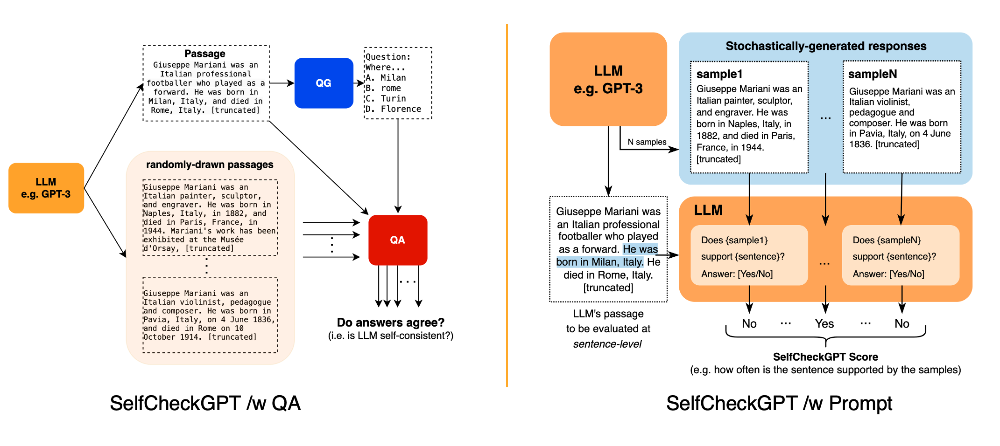

# SelfCheckGPT

[SelfCheckGPT](https://arxiv.org/abs/2303.08896) is a simple sampling-based technique that relies on the idea that an Language Language Model (LLM) has inherent knowledge of facts and if prompted multiple times should be output a similar/consistent response. Existing fact-checking methods require output token-level probabilities which may not be accessible. As such, [SelfCheckGPT](https://arxiv.org/abs/2303.08896) presents a black-box zero-resource solution that only requires text-based responses to evaluate for hallucinations.


*[Image from SelfCheckGPT repo](https://github.com/potsawee/selfcheckgpt)*

SelfCheckGPT has a few variants:

1. SelfCheckGPT with BERTScore
2. SelfCheckGPT with Question Answering
3. SelfCheckGPT with $n$-gram
4. SelfCheckGPT with Natural Language Inference (NLI)
5. SelfCheckGPT with LLM Prompt

For each user query, a response is generated from the LLM that we are trying to evaluate, the response is referred to as $R$. Using the same query, $N$ further response samples are generated. For each approach below, SelfCheckGPT predicts a score for the $i$-th sentence that is between `0` and `1` where `0` represents consistent grounded information while `1.0` implies that $R$ is hallucinated.

## SelfCheckGPT with BERTScore

Given the $i$-th sentence of a response $R$, SelfCheckGPT with BERTScore finds the average BERTScore with the most similar sentence from each of the $N$ sample responses. The idea is that if the same information appears in multiple sample responses then it should be factually correct.

!!! info "Guide: BERTScore"

    Read the [BERTScore](./bertscore.md) guide if you're not familiar.


## SelfCheckGPT with Question Answering

SelfCheckGPT with QA uses automatic multiple-choice question answering generation (MCQAG) to measure consistency. It contains two independent phases, question generation and question answering. Using the response $R$, a set of multiple-choice questions (MCQ) are generated. These MCQ are then passed as inputs to an indepedent question answering system that is conditioned are the $N$ sample responses where an inconsistency score is calculated.


## SelfCheckGPT with $n$-gram

SelfCheckGPT with $n$-gram trains a simple $n$-gram model using the $N$ sample responses as well as the response $R$ to compute token-level probabilities for tokens in each sentence from $R$. The score is computed by the following formula:

$$
S_{n\text{-gram}}^\text{Avg}(i) = -\frac{1}{J} \sum_{j} \log{\tilde{p}_{ij}}
$$

where $\tilde{p}_{ij}$ is the probability output from the $n$-gram model of the $j$-th token from $i$-th sentence in $R$.

## SelfCheckGPT with Natural Language Inference (NLI)

SelfCheck-NLI is based on Microsoft's [deberta-v3-large](https://huggingface.co/microsoft/deberta-v3-large) finetuned on the [Multi-Genre NLI Dataset](https://cims.nyu.edu/~sbowman/multinli/). The NLI model takes in a sentence and sample response as inputs and generates an entailment (or contradiction) score.

## SelfCheckGPT with LLM Prompt

With this approach, SelfCheckGPT utilizes an LLM such as GPT-3 and the following prompt schema:
```
Context: {}
Sentence: {}
Is the sentence supported by the context above?
Answer Yes or No:
```
to obtain a hallucination score where `Yes` is `0.0` and `No` is `1.0`.

## Implementation Details
SelfCheckGPT contains detailed and comprehensive usage details in their [code repository](https://github.com/potsawee/selfcheckgpt).

## Limitations and Advantages

SelfCheckGPT is a very powerful black-box evaluation approach thats advantages come from its overall lower resource usage as well as its performance despite only having access to text-based responses. However, SelfCheckGPT can often be mislead by sentences that contain consistent by factually incorrect statements and for the best variant of SelfCheckGPT with LLM Prompt, it can also be computationally heavy.
